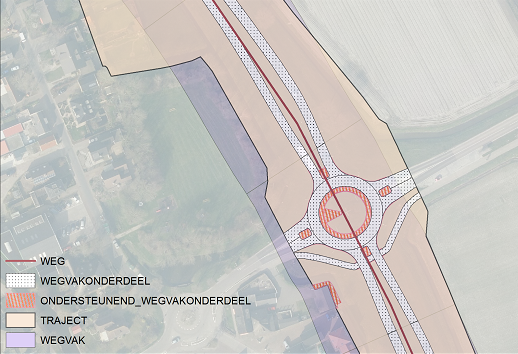

## BUDATA.WEGVAK

* __BGT inhoud:__ Nee
* __Herkomst Definitie:__ PNH
* __Positionele nauwkeurigheid:__ nvt
* __Geometrie:__ Vlak
* __Definitie:__ Administratief afgebakend gedeelte van een weg waarbinnen de inspectiemetingen uitgevoerd worden.
Een wegvak is doorgaands 100 meter en loopt in de meeste gevallen gelijk aan de wegindexering (hectometerpalen).

Wegvak t.o.v. weg, wegvakonderdeel en traject

***

|KOLOM                               |TYPE              |DEFINITIE|
|------                              |----              |-----    |
|STATUS                              |VARCHAR2(255)     |Status van de gegevens, keuzelijst [CT_STATUS]|
|NUMMER                              |NUMBER(10,0)      |Wegvak nummer, uniek per weg|
|AFSTANDTOT                          |NUMBER(25,10)     |Aanduiding bij welk wegindexeringspaal (hectometerpaal) het inspectievak eindigt|
|AFSTANDVAN                          |NUMBER(25,10)     |Aanduiding bij welk wegindexeringspaal (hectometerpaal) het inspectievak begint|
|BUSROUTE                            |NUMBER(1,0)       |TODO|
|OMSCHRIJVING                        |VARCHAR2(255)     |Extra toelichting|
|PERCENTAGEVRACHTVE                  |NUMBER(10,0)      |TODO|
|VERKEERSINTENSITEI                  |NUMBER(10,0)      |TODO|
|TYPEONDERGROND                      |VARCHAR(255)      |Type ondergrond, keuzelijst [CT_TYPE_ONDERGROND]|
|GUID                                |VARCHAR2(40)      |Global Unique Identifier|
|GEOMETRIE                           |SDO_GEOMETRY      |Vlak|
|ID                                  |NUMBER(10,0)      |Primary Key|
|OBJBEGINTIJD                        |DATE              |Begintijd object|
|OBJEINDTIJD                         |DATE              |Eindtijd object (bij vervallen objecten)|
|OBJECTID                            |NUMBER(38)        |Interne ID ArcGIS|
|LAST_UPDATE                         |DATE              |GISIB, Datum waarop het object voor het laatst gewijzigd is in GISIB|
|WEG                                 |NUMBER(10,0)      |FK naar Weg object|
|TRAJECT                             |NUMBER(10,0)      |FK naar Traject object|

***

