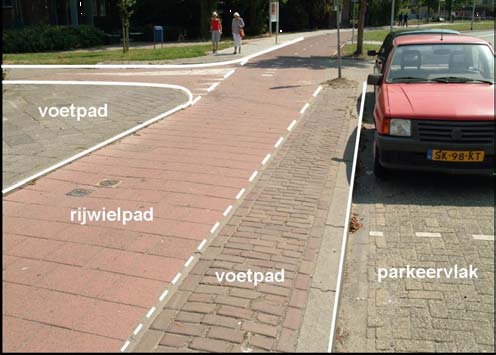

## BUDATA.WEGVAKONDERDEEL

* __BGT inhoud:__ Ja
* __Herkomst Definitie:__ IMGeo BGT (Wegdeel)
* __Positionele nauwkeurigheid:__ 7,5 cm (NB, groter dan BGT)
* __Geometrie:__ Vlak
* __Definitie:__ Kleinste functioneel onafhankelijk stuk van een NEN 3610 Weg met gelijkblijvende, homogene eigenschappen
en relaties en primair bedoeld voor gebruik door weg-, spoor- en vliegverkeer te land.

In de foto is het attribuut ‘Type Onderdeel’ weergegeven per ‘Wegvakonderdeel’

***

|KOLOM                               |TYPE              |DEFINITIE|
|------                              |----              |-----    |
|STATUS                              |VARCHAR2(255)     |Status van de gegevens, keuzelijst [CT_STATUS]|
|WEGVAKONDERDEELFUNCTIE              |VARCHAR2(255)     |Wegvakonderdeel functie volgens CROW, keuzelijst [CT_WEGVAKONDERDEEL_FUNCTIE]|
|BREEDTE                             |NUMBER(25,10)     |Breedte van het wegvakonderdeel (m, 2 decimalen)|
|COMFORT                             |VARCHAR2(255)     |Comfort waarde|
|COMFORT_DATE                        |DATE              |Datum comfort meting|
|DEFLECTIE                           |VARCHAR2(255)     |Deflectie waarde|
|DEFLECTIE_DATE                      |DATE              |Datum deflectie meting|
|OMSCHRIJVING                        |VARCHAR2(255)     |Extra toelichting|
|KOMGRENS                            |VARCHAR2(255)     |Komgrens|
|WEGTYPE                             |VARCHAR2(255)     |Wegtype, keuzelijst [CT_WEGTYPE]|
|WEGINDELING                         |VARCHAR2(255)     |Wegindeling, keuzelijst [CT_WEGINDELING]|
|JAARAANLEG                          |NUMBER(10,0)      |Jaar aanleg van de weg|
|JAARCONSERVEREN                     |NUMBER(10,0)      |Jaar van conservering|
|JAARDEKLAAG                         |NUMBER(10,0)      |Jaar deklaag gelegd|
|JAARHERSTRATEN                      |NUMBER(10,0)      |Jaar Herbestrating gelegd|
|JAARVERNIEUWEN                      |NUMBER(10,0)      |TODO|
|LANGSONVLAKHEID                     |VARCHAR2(255)     |Langsonvlakheid meting|
|LANGSONVLAKHEID_DATE                |DATE              |Datum langsonvlakheid meting|
|LENGTE                              |NUMBER(10,0)      |Lengte van het wegvakonderdeel (hele meters)|
|LENGTEVOEGEN                        |NUMBER(10,0)      |Lengte van de voegen (m)|
|OPPERVLAKTE                         |NUMBER(25,10)     |Oppervlakte van het wegvakonderdeel (m2, 2 decimalen)|
|SPOORVORMING                        |VARCHAR2(255)     |Spoorvorming meting|
|SPOORVORMING_DATE                   |DATE              |Datum spoorvorming meting|
|GEBRUIKSFUNCTIE                     |VARCHAR2(255)     |Gebruiksfunctie conform CROW, keuzelijst [CT_GEBRUIKSFUNCTIE]|
|SITUERING                           |VARCHAR2(255)     |Situering conform CROW, keuzelijst [CT_SITUERING]|
|STROEFHEID                          |VARCHAR2(255)     |Stroefheid meting|
|STROEFHEID_DATE                     |DATE              |Datum stroefheid meting|
|TYPEONDERDEEL                       |VARCHAR2(255)     |Typeonderdeel conform CROW, keuzelijst [CT_TYPE_ONDERDEEL]|
|VERHARDING                          |VARCHAR2(255)     |Verharding object conform CROW, keuzelijst [CT_VERHARDING]|
|VERHARDINGCATEGORIE                 |VARCHAR2(255)     |Verharding categorie conform CROW, keuzelijst [CT_VERHARDING_CATEGORIE]|
|EIGENAAR                            |VARCHAR2(255)     |Eigenaar van het wegvakonderdeel, keuzelijst [CT_EIGENAAR]|
|BEHEERDER                           |VARCHAR2(255)     |Beheerder van het wegvakonderdeel, keuzelijst [CT_BEHEERDER]|
|ONDERHOUDER                         |VARCHAR2(255)     |Onderhouder van het wegvakonderdeel, keuzelijst [CT_ONDERHOUDER]|
|WGV_AFSTANDTOT                      |NUMBER(25,10)     |Wegvak, Aanduiding bij welk wegindexeringspaal (hectometerpaal) het inspectievak eindigt|
|WGV_AFSTANDVAN                      |NUMBER(25,10)     |Wegvak, Aanduiding bij welk wegindexeringspaal (hectometerpaal) het inspectievak begint|
|WGV_NUMMER                          |NUMBER(10,0)      |Wegvak, Wegvak nummer, uniek per weg|
|IDENTIFICATIE                       |VARCHAR2(44)      |BGT, Uniek identificatienummer voor het object dat onveranderlijk is zolang het object bestaat|
|BRONHOUDER                          |VARCHAR2(20)      |BGT, De bronhoudercode van het object|
|IMGEO_INONDERZOEK                   |VARCHAR(255)      |BGT, Een aanduiding waarmee wordt aangegeven dat een onderzoek wordt uitgevoerd naar de juistheid van een of meer gegevens van het betreffende object: Ja/Nee [CT_JA_NEE] |
|RELHOOGTELIGGING                    |NUMBER(10,0)      |BGT, Aanduiding voor de relatieve hoogte van het object|
|EINDREGISTRATIE                     |DATE              |BGT, Eind van de periode waarop deze instantie van het object geldig is bij de bronhouder. Wanneer deze waarde niet is ingevuld is de instantie nog geldig|
|TIJDSTIPREGISTRATIE                 |DATE              |BGT, Tijdstip waarop deze instantie van het object is opgenomen door de bronhouder|
|IMGEO_OPTALUD                       |VARCHAR(255)      |BGT, Indicatie of het object op het talud ligt: Ja/Nee [CT_JA_NEE]|
|GUID                                |VARCHAR2(40)      |Global Unique Identifier|
|GEOMETRIE                           |SDO_GEOMETRY      |Vlak|
|ID                                  |NUMBER(10,0)      |Primary Key|
|IMGEO_LVPUBLICATIEDATUM             |DATE              |BGT, Tijdstip waarop deze instantie van het object is opgenomen in de Landelijke Voorziening|
|IMGEO_KLASSE                        |VARCHAR(255)      |BGT, hoofdclassificatie van het object, keuzelijst [CT_IMGEO_KLASSE]|
|IMGEO_FYSIEKVOORKOMEN               |VARCHAR(255)      |BGT, fysieke voorkomen van het object, keuzelijst [CT_IMGEO_FYSIEKVOORKOMEN]|
|IMGEO_FYSIEKVOORKOMEN_PLUS          |VARCHAR(255)      |BGT, nadere typering van het fysieke voorkomen van het object, keuzelijst [CT_IMGEO_FYSIEKVOORKOMEN_PLUS]|
|IMGEO_FUNCTIE                       |VARCHAR(255)      |BGT, functie die het object vervult in de openbare ruimte, keuzelijst [CT_IMGEO_FUNCTIE]|
|IMGEO_FUNCTIE_PLUS                  |VARCHAR(255)      |BGT, nadere typering van de functie die het object vervult, keuzelijst [CT_IMGEO_FUNCTIE_PLUS]|
|IMGEO_KRUINLIJN                     |VARCHAR(255)      |BGT, FK naar kruinlijn|
|OBJBEGINTIJD                        |DATE              |BGT, Datum waarop het object bij de bronhouder is ontstaan|
|OBJEINDTIJD                         |DATE              |BGT, Datum waarop het object bij de bronhouder niet meer geldig is|
|OBJECTID                            |NUMBER(38,0)      |Interne ID ArcGIS|
|LAST_UPDATE                         |DATE              |GISIB, Datum waarop het object voor het laatst gewijzigd is in GISIB|
|GEO_OBJECT                          |NUMBER(10,0)      |GISIB, Interne ID van gekoppeld Gisib geo object|
|HALTE                               |NUMBER(10,0)      |FK naar Halte|
|WEGVAK                              |NUMBER(10,0)      |FK naar Wegvak object|
|TRAJECT                             |NUMBER(10,0)      |FK naar Traject|

***

