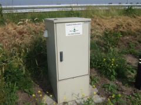

## BUDATA.GMS_KAST

* __BGT inhoud:__ Nee
* __Herkomst Definitie:__ PNH
* __Positionele nauwkeurigheid:__ 15 cm
* __Geometrie:__ Punt
* __Definitie:__ Behuizing langs de provinciale weg waarin een meetunit geplaatst is voor het meten, opslaan en verzenden van lokale weers- en wegdek omstandigheden

|
GMS kast buitenkant - GMS Kast binnenkant

***

|KOLOM                               |TYPE              |DEFINITIE|
|------                              |----              |-----    |
|STATUS                              |VARCHAR2(255)     |Status van de gegevens, keuzelijst [CT_STATUS]|
|TYPE_GMS_KAST                       |VARCHAR2(255)     |Type Kast, keuzelijst [CT_TYPE_GMS_KAST]|
|LOCATIE_OMSCHR                      |VARCHAR2(255)     |Omschrijving van de locatie|
|STEUNPUNT                           |VARCHAR2(255)     |Naam van het steunpunt behorende bij route vanuit steunpunt [CT_STEUNPUNT]|
|BEHEERDER                           |VARCHAR2(255)     |Beheerder van het object, keuzelijst [CT_BEHEERDER]|
|ONDERHOUDER                         |VARCHAR2(255)     |Onderhouder van het object, keuzelijst [CT_ONDERHOUDER]|
|EIGENAAR                            |VARCHAR2(255)     |Eigenaar van het object, keuzelijst [CT_INSTANTIE]|
|MEETUNITNUMMER                      |NUMBER(10,0)      |Het nummer die de computerunit in de GMS kast uniek identificeert|
|VOEDING                             |VARCHAR2(255)     |Keuze uit ‘220V’ of ‘OV’ |
|DATATRANSPORT                       |VARCHAR2(255)     |Keuze uit ‘KPN kabel’ of ‘GPRS’|
|DATUMGARANTIE                       |DATE              |Datum garantie|
|DATUMPLAATSING                      |DATE              |Datum plaatsing|
|OMSCHRIJVING                        |VARCHAR2(255)     |Extra toelichting|
|GUID                                |VARCHAR2(40)      |Global Unique Identifier|
|GEOMETRIE                           |SDO_GEOMETRY      |Punt|
|ID                                  |NUMBER(10,0)      |Primary Key|
|OBJECTID                            |NUMBER(38,0)      |Interne ID ArcGIS|
|LAST_UPDATE                         |DATE              |GISIB, Datum waarop het object voor het laatst gewijzigd is in GISIB|
|OBJBEGINTIJD                        |DATE              |BGT, Datum waarop het object bij de bronhouder is ontstaan|
|OBJEINDTIJD                         |DATE              |BGT, Datum waarop het object bij de bronhouder niet meer geldig is|
|KRUISPUNT                           |NUMBER(10,0)      |FK naar Kruispunt|
|TRAJECT                             |NUMBER(10,0)      |FK naar Traject|
|WEG                                 |NUMBER(10,0)      |FK naar Weg|

***
