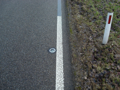

## BUDATA.MARKERINGSUNIT

* __BGT inhoud:__ Nee
* __Herkomst Definitie:__ PNH
* __Positionele nauwkeurigheid:__ 15 cm
* __Geometrie:__ Punt
* __Definitie:__ Light Emitting Diode. Elektronisch component dat licht uitzendt als er elektrische stroom doorheen wordt gestuurd. LED’s worden ingebouwd in units voor in de weg, banden of armaturen

LED-unit in wegdek

***

|KOLOM                               |TYPE              |DEFINITIE|
|------                              |----              |-----    |
|STATUS                              |VARCHAR2(255)     |Status van de gegevens, keuzelijst [CT_STATUS]|
|DATUMGARANTIE                       |DATE              |Datum garantie|
|DATUMPLAATSING                      |DATE              |Datum plaatsing|
|OMSCHRIJVING                        |VARCHAR2(255)     |Extra toelichting|
|RICHTING                            |VARCHAR2(255)     |TODO|
|FABRIKANTTYPECODE                   |VARCHAR2(255)     |Fabrikanttypecode, keuzelijst [CT_FABRIKANT_TYPECODE]|
|SOORTENERGIE                        |VARCHAR2(255)     |Soort energie, keuzelijst [CT_SOORT_ENERGIE]|
|BEHEERDER                           |VARCHAR2(255)     |Beheerder van het object, keuzelijst [CT_BEHEERDER]|
|ONDERHOUDER                         |VARCHAR2(255)     |Onderhouder van het object, keuzelijst [CT_ONDERHOUDER]|
|EIGENAAR                            |VARCHAR2(255)     |Eigenaar van het object, keuzelijst [CT_INSTANTIE]|
|GUID                                |VARCHAR2(40)      |Global Unique Identifier|
|GEOMETRIE                           |SDO_GEOMETRY      |Punt|
|ID                                  |NUMBER(10,0)      |Primary Key|
|IDENTIFICATIE                       |VARCHAR2(44)      |BGT, Uniek identificatienummer voor het object dat onveranderlijk is zolang het object bestaat|
|INONDERZOEK                         |CHAR(1)           |BGT, Een aanduiding waarmee wordt aangegeven dat een onderzoek wordt uitgevoerd naar de juistheid van een of meer gegevens van het betreffende object|
|IMGEO_LVPUBLICATIEDATUM             |DATE              |BGT, Tijdstip waarop deze instantie van het object is opgenomen in de Landelijke Voorziening|
|IMGEO_KLASSE                        |NUMBER(10,0)      |BGT, hoofdclassificatie van het object, keuzelijst [CT_IMGEO_KLASSE]|
|IMGEO_TYPE                          |NUMBER(10,0)      |BGT, typering van het object, keuzelijst [CT_IMGEO_TYPE] |
|IMGEO_TYPE_PLUS                     |NUMBER(10,0)      |BGT, nadere typering van het object, keuzelijst [CT_IMGEO_TYPE_PLUS]|
|OBJBEGINTIJD                        |DATE              |BGT, Datum waarop het object bij de bronhouder is ontstaan|
|OBJEINDTIJD                         |DATE              |BGT, Datum waarop het object bij de bronhouder niet meer geldig is|
|OBJECTID                            |NUMBER(38,0)      |Interne ID ArcGIS|
|LAST_UPDATE                         |DATE              |GISIB, Datum waarop het object voor het laatst gewijzigd is in GISIB|
|GEO_OBJECT                          |NUMBER(10,0)      |GISIB, Interne ID van gekoppeld Gisib geo object|
|OVLINSTALLATIE                      |NUMBER(10,0)      |FK naar OVL Installatie|
|TRAJECT                             |NUMBER(10,0)      |FK naar Traject|
|RELHOOGTELIGGING                    |NUMBER(10,0)      |BGT, Aanduiding voor de relatieve hoogte van het object|
***
