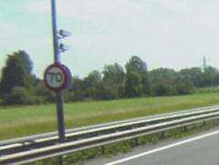

## BUDATA.OBSERVATIE_CAMERA

* __BGT inhoud:__ Nee
* __Herkomst Definitie:__ PNH
* __Positionele nauwkeurigheid:__ nvt
* __Geometrie:__ Punt
* __Definitie:__ Camera ter observatie van verkeer. __NB:__ alleen de camera's voor verkeersmonitoring, dus geen roodlicht/snelheidscamera's

|-------|------|
|||
|observatie camera||

***

|KOLOM                           	|TYPE          	|DEFINITIE|
|------                          	|----          	|-----    |
|ID                              	|NUMBER(10,0)  	|Primary Key|
|GEOMETRIE                       	|SDO_GEOMETRY  	|Punt|
|DATUMGARANTIE                   	|DATE          	|Datum garantie|
|DATUMPLAATSING                  	|DATE          	|Datum plaatsing|
|OMSCHRIJVING                    	|VARCHAR2(255) 	|extra toelichting|
|GUID                            	|VARCHAR2(40)  	|Global Unique Identifier|
|LEVENSVERWACHTING               	|NUMBER(10,0)  	|Levensverwachting|
|PLANJAAR                        	|NUMBER(10,0)  	|Planjaar|
|RESTLEVENSDUUR                  	|NUMBER(10,0)  	|Restlevensduur|
|VOORGENVERVDATUM                	|DATE          	|Voorgenomen vervangingsdatum|
|FABRIKANTTYPECODE               	|VARCHAR2(255) 	|Fabrikanttypecode, keuzelijst [CT_FABRIKANT_TYPECODE]|
|MAST                            	|NUMBER(10,0)  	|FK naar Mast als camera daarop bevestigd is|
|STATUS                          	|VARCHAR2(255) 	|Status van de gegevens, keuzelijst [CT_STATUS]|
|UITLEGGERPORTAAL                	|NUMBER(10,0)  	|FK naar Uitlegger/Portaal als camera daarop bevestigd is|
|BEHEERDER                       	|VARCHAR2(255) 	|Beheerder van de observatiecamera, keuzelijst [CT_INSTANTIE]|
|EIGENAAR                        	|VARCHAR2(255) 	|Eigenaar van de observatiecamera, keuzelijst [CT_INSTANTIE]|
|OBJBEGINTIJD                    	|DATE          	|BGT, Datum waarop het object bij de bronhouder is ontstaan|
|OBJEINDTIJD                     	|DATE          	|BGT, Datum waarop het object bij de bronhouder niet meer geldig is|
|OBJECTID                        	|NUMBER(38,0)   |Interne ID ArcGIS|
|TOPDESK_ID							|VARCHAR2(255) 	|Verwijzing naar ObjectID TOPdesk|
|RELHOOGTELIGGING                	|NUMBER(10,0)  	|BGT, Aanduiding voor de relatieve hoogte van het object|

***

