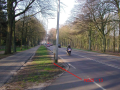

## BUDATA.TELPAAL

* __BGT inhoud:__ Nee
* __Herkomst Definitie:__ PNH
* __Positionele nauwkeurigheid:__ 15 cm
* __Geometrie:__ Punt
* __Definitie:__ Telpalen zijn permanente voorzieningen waar periodiek een verkeersteller wordt geplaatst

|-------|------|
|||
|telpaal||

***

|KOLOM                               |TYPE              |DEFINITIE|
|------                              |----              |-----    |
|STATUS                              |VARCHAR2(255)     |Status van de gegevens, keuzelijst [CT_STATUS]|
|AANTALLUSSEN                        |VARCHAR2(255)     |Aantal lussen dat in het asfalt is aangelegd voor verkeertellingen|
|DATATRANSPORT                       |VARCHAR2(255)     |Manier van datatransport. Keuze uit:Vaste lijn (KPN lijn), GSM|
|DATUMGARANTIE                       |DATE              |Datum garantie|
|DATUMPLAATSING                      |DATE              |Datum plaatsing|
|OMSCHRIJVING                        |VARCHAR2(255)     |Extra toelichting|
|HOOGTE                              |NUMBER(10,0)      |Hoogte|
|TELPUNTCODE                         |VARCHAR2(255)     |Administratieve code om de ligging van de telkast/telpaal aan te duiden|
|VOEDING                             |VARCHAR2(255)     |Manier van energieverzorging. Keuze uit:220, Zonne-energie|
|BEHEERDER                           |VARCHAR2(255)     |Beheerder van het object, keuzelijst [CT_BEHEERDER]|
|ONDERHOUDER                         |VARCHAR2(255)     |Onderhouder van het object, keuzelijst [CT_ONDERHOUDER]|
|EIGENAAR                            |VARCHAR2(255)     |Eigenaar van het object, keuzelijst [CT_INSTANTIE]|
|GUID                                |VARCHAR2(40)      |Global Unique Identifier|
|GEOMETRIE                           |SDO_GEOMETRY      |Punt|
|ID                                  |NUMBER(10,0)      |Primary Key|
|OBJECTID                            |NUMBER(38,0)      |Interne ID ArcGIS|
|LAST_UPDATE                         |DATE              |GISIB, Datum waarop het object voor het laatst gewijzigd is in GISIB|

|OBJBEGINTIJD                        |DATE              |BGT, Datum waarop het object bij de bronhouder is ontstaan|
|OBJEINDTIJD                         |DATE              |BGT, Datum waarop het object bij de bronhouder niet meer geldig is|
|TRAJECT                             |NUMBER (10,0)     |FK naar Traject|
|VRIINSTALLATIE                      |NUMBER(10,0)      |FK naar VRI Installatie|
|WEG                                 |NUMBER(10,0)      |FK naar Weg|
|KRUISPUNT                           |NUMBER(10,0)      |FK naar Kruispunt|

***
