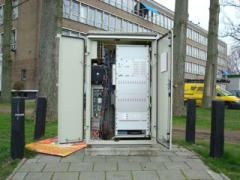
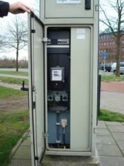

## BUDATA.VRI_KAST

* __BGT inhoud:__ Nee
* __Herkomst Definitie:__ PNH
* __Positionele nauwkeurigheid:__ 15 cm
* __Geometrie:__ Punt
* __Definitie:__ Kast ten behoeve van de regeling van verkeerslichten

|
VRI-kast buitenkant - VRI-kast binnenkant
|
VRI-kast elektriciteitsgedeelte - VRI-kast instelpaneel lichten

***

|KOLOM                               |TYPE              |DEFINITIE|
|------                              |----              |-----    |
|STATUS                              |VARCHAR2(255)     |Status van de gegevens, keuzelijst [CT_STATUS]|
|OMSCHRIJVING                        |VARCHAR2(255)     |Extra toelichting|
|TOPDESK_ID                          |VARCHAR2(255)     |Verwijzing naar ObjectID TOPdesk|
|ADSLKENMERK                         |VARCHAR2(255)     |TODO|
|BEHEERDER                           |VARCHAR2(255)     |Beheerder van het object, keuzelijst [CT_BEHEERDER]|
|ONDERHOUDER                         |VARCHAR2(255)     |Onderhouder van het object, keuzelijst [CT_ONDERHOUDER]|
|EIGENAAR                            |VARCHAR2(255)     |Eigenaar van het object, keuzelijst [CT_INSTANTIE]|
|AUTOMAATKOPPELING                   |VARCHAR2(255)     |Indicatie of de automaat gekoppeld is aan één of meer andere automaten |
|CONTRACTNUMONDERH                   |VARCHAR2(255)     |Nummer van het contract met de onderhouder|
|DATUMGARANTIE                       |DATE              |TODO|
|DATUMPLAATSING                      |DATE              |Datum plaatsing kast|
|JAAR_PLAATSING_AANLEG_GESCHAT       |NUMBER(2,0)       |Jaar plaatsing of aanleg is geschat: ja of nee (keuzelijst [CT_JA_NEE])|
|DEELCONFLICT                        |VARCHAR2(255)     |TODO|
|DYNAMISCHVERKEERSM                  |VARCHAR2(255)     |TODO|
|EANEMETER                           |VARCHAR2(255)     |De EAN-code vermeld op de meter|
|FTPGEBRUIKERSWACHT                  |VARCHAR2(255)     |TODO|
|FTPGEBRUIKERSNAAM                   |VARCHAR2(255)     |TODO|
|INDIVIDUELELAMPMEL                  |VARCHAR2(255)     |TODO|
|IVERAINBELWACHTWOO                  |VARCHAR2(255)     |T.b.v. de communicatie met de VRI-beheercentrale|
|IVERAINBELNAAM                      |VARCHAR2(255)     |T.b.v. de communicatie met de VRI-beheercentrale|
|IVERAIP                             |VARCHAR2(255)     |T.b.v. de communicatie met de VRI-beheercentrale|
|IVERALICENTIENUMME                  |VARCHAR2(255)     |T.b.v. de communicatie met de VRI-beheercentrale|
|IVERAPIN                            |VARCHAR2(255)     |T.b.v. de communicatie met de VRI-beheercentrale|
|IVERAVERSIENUMMER                   |VARCHAR2(255)     |Versienummer van de aansluiting|
|KANVASADRES                         |VARCHAR2(255)     |TODO|
|KARANTENNE                          |VARCHAR2(255)     |Kar Antenne aanwezig ja/nee|
|KASTTYPE                            |VARCHAR2(255)     |TODO|
|KWCLICENTIENUMMER                   |VARCHAR2(255)     |T.b.v. de aansluiting op de kwaliteitscentrale|
|LEVENSVERWACHTING                   |NUMBER(10,0)      |TODO|
|NUMMERGEKOPPELDEAU                  |VARCHAR2(255)     |Indien een automatenkoppeling: de soort koppeling (groene golf, peletonkoppeling, etc.)|
|PLANJAAR                            |NUMBER(10,0)      |TODO|
|PRIOVOORZIENINGEN                   |VARCHAR2(255)     |Indicatie of de kast één of meer prioriteitsvoorzieningen bevat |
|RALKLEUR                            |VARCHAR2(255)     |TODO|
|RESTLEVENSDUUR                      |NUMBER(10,0)      |Restlevensduur|
|ROODLAMPBEWAKING                    |VARCHAR2(255)     |Rood Lamp Bewaking|
|SERIENUMMER                         |VARCHAR2(255)     |Serienummer van de fabrikant (5 á 6 posities)|
|SIMNUMMER                           |VARCHAR2(255)     |TODO|
|SOORTPRIOVOORZIENI                  |VARCHAR2(255)     |Indien een kast één of meer prioriteitsvoorzieningen bevat: de soort prioriteitsvoorziening (KAR (t.b.v. bussen OV een modem) of VTAG, SICS (dan een kaart))|
|SSIDKORTEAFSTANDRA                  |VARCHAR2(255)     |SSID van de KAR|
|TELNUMMER                           |NUMBER(10,0)      |Het telefoonnummer van de automaat|
|VOORGENVERVDATUM                    |VARCHAR2(255)     |Datum waarop de kast vervangen moet worden.|
|ZIJWEG                              |VARCHAR2(255)     |Straatnaam (één vermelden, ook al zijn er meer)|
|DIMMETHODE                          |VARCHAR2(255)     |Dimmethode, keuzelijst [CT_DIMMETHODE]|
|FABRIKANTTYPECODE                   |VARCHAR2(255)     |Fabrikant typecode, keuzelijst [CT_FABRIKANT_TYPECODE]|
|LAMPSPANNING                        |VARCHAR2(255)     |Lampspanning waarde, keuzelijst [CT_LAMP_SPANNING]|
|SOORTAUTOMAATKOPPE                  |VARCHAR2(255)     |Soort Automaatkoppeling, keuzelijst [CT_SOORT_AUTOMAATKOPPELING]|
|TYPECOMMUNICATIE                    |VARCHAR2(255)     |Type communicatie, keuzelijst [CT_TYPE_COMMUNICATIE]|
|GUID                                |VARCHAR2(40)      |Global Unique Identifier|
|GEOMETRIE                           |SDO_GEOMETRY      |Punt|
|ID                                  |NUMBER(10,0)      |Primary Key|
|IDENTIFICATIE                       |VARCHAR2(44)      |BGT, Uniek identificatienummer voor het object dat onveranderlijk is zolang het object bestaat|
|IMGEO_INONDERZOEK                         |VARCHAR(255)           |BGT, Een aanduiding waarmee wordt aangegeven dat een onderzoek wordt uitgevoerd naar de juistheid van een of meer gegevens van het betreffende object: Ja/Nee [CT_JA_NEE] |
|IMGEO_LVPUBLICATIEDATUM             |DATE              |BGT, Tijdstip waarop deze instantie van het object is opgenomen in de Landelijke Voorziening|
|IMGEO_KLASSE                        |VARCHAR(255)      |BGT, hoofdclassificatie van het object, keuzelijst [CT_IMGEO_KLASSE]|
|IMGEO_TYPE                          |VARCHAR(255)      |BGT, typering van het object, keuzelijst [CT_IMGEO_TYPE] |
|IMGEO_TYPE_PLUS                     |VARCHAR(255)      |BGT, nadere typering van het object, keuzelijst [CT_IMGEO_TYPE_PLUS]|
|OBJBEGINTIJD                        |DATE              |BGT, Datum waarop het object bij de bronhouder is ontstaan|
|OBJEINDTIJD                         |DATE              |BGT, Datum waarop het object bij de bronhouder niet meer geldig is|
|OBJECTID                            |NUMBER(38,0)      |Interne ID ArcGIS|
|LAST_UPDATE                         |DATE              |GISIB, Datum waarop het object voor het laatst gewijzigd is in GISIB|
|GEO_OBJECT                          |NUMBER(10,0)      |GISIB, Interne ID van gekoppeld Gisib geo object|
|RELHOOGTELIGGING                    |NUMBER(10,0)      |BGT, Aanduiding voor de relatieve hoogte van het object|
|TRAJECT                             |NUMBER (10,0)     |FK naar Traject|
|VRIINSTALLATIE                      |NUMBER(10,0)      |FK naar VRI Installatie|

***

