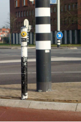

## BUDATA.MAST

* __BGT inhoud:__ Nee
* __Herkomst Definitie:__ PNH
* __Positionele nauwkeurigheid:__ 5-10 cm (het hart van de mast wordt gemeten)
* __Geometrie:__ Punt
* __Definitie:__ Hoge draagconstructie, vervaardigd van metaal, hout, steen of kunststof dat dient om iets te dragen of af te bakenen.

|-------|------|
|||
|Drukknopmast|Unimast|
|||
|Zweepmast, bestaat uit 1 mast en een uitlegger_portaal|Portaal, bestaat uit 2 masten en een uitlegger_portaal|

***

|KOLOM                           	|TYPE          	|DEFINITIE|
|------                          	|----          	|-----    |
|STATUS                          	|VARCHAR2(255) 	|Status van de gegevens, keuzelijst [CT_STATUS]|
|ID                              	|NUMBER(10,0)  	|Primary Key|
|GEOMETRIE                       	|SDO_GEOMETRY  	|Punt|
|AANTALLUIKEN                    	|NUMBER(10,0)  	|Aantal luiken|
|AARDRAADAANWEZIG                	|VARCHAR2(20)  	|Aarddraad aanwezig|
|CAMERAOPZETSTUK                 	|VARCHAR2(255) 	|Camera opzetstuk aanwezig|
|CONSERVERING                    	|VARCHAR2(255) 	|Conservering toegepast|
|DATUMGARANTIE                   	|DATE          	|Datum Garantie|
|DATUMPLAATSING                  	|DATE          	|Datum plaatsing|
|OMSCHRIJVING                    	|VARCHAR2(255) 	|extra toelichting|
|ELEVATIEHOEK                    	|NUMBER(10,0)  	|hoek van de uithouder indien aanwezig|
|GUID                            	|VARCHAR2(40)  	|Global Unique Identifier|
|HOOGTE                          	|NUMBER(10,0)  	|Lichtpunt hoogte|
|LENGTEUITHOUDER1                	|NUMBER(25,10) 	|Lengte van de uithouder indien aanwezig|
|LEVENSVERWACHTING               	|NUMBER(10,0)  	|Levensverwachting|
|MASTNUMMER                      	|VARCHAR2(255) 	|Mast nummer|
|OPMERKING                       	|VARCHAR2(2000)	|extra toelichting|
|PLANJAAR                        	|NUMBER(10,0)  	|TODO|
|RALKLEUR                        	|VARCHAR2(255) 	|RAL Kleur|
|RESTLEVENSDUUR                  	|NUMBER(10,0)  	|TODO|
|VORM                            	|VARCHAR2(255) 	|Vorm van de mast|
|FABRIKANTTYPECODE               	|VARCHAR2(255) 	|Fabrikanttypecode, keuzelijst [CT_FABRIKANT_TYPECODE]|
|KRUISPUNT                       	|NUMBER(10,0)  	|FK naar Kruispunt|
|MATERIAALTYPE                   	|VARCHAR2(255)  |Type materiaal, keuzelijst [CT_MATERIAALTYPE]|
|OVLINSTALLATIE                  	|NUMBER(10,0)  	|FK naar OVLInstallatie (indien lichtmast)|
|BEHEERDER                       	|VARCHAR2(255) 	|Beheerder van de mast, keuzelijst [CT_INSTANTIE]|
|EIGENAAR                        	|VARCHAR2(255) 	|Eigenaar van de mast, keuzelijst [CT_INSTANTIE]|
|OBJBEGINTIJD                    	|DATE          	|BGT, Datum waarop het object bij de bronhouder is ontstaan|
|OBJEINDTIJD                     	|DATE          	|BGT, Datum waarop het object bij de bronhouder niet meer geldig is|
|LENGTEUITHOUDER2                	|NUMBER(25,10) 	|Lengte van de uithouder indien aanwezig|
|OBJECTID                        	|NUMBER(38,0)   |Interne ID ArcGIS|
|UITLEGGER_PORTAAL					|NUMBER (10,0)	|FK naar Uitlegger Portaal|
|TYPEMAST							|VARCHAR2(255)	|Type Mast, keuzelijst [CT_TYPE_MAST]|
|VRIINSTALLATIE						|NUMBER (10,0)	|FK naar VRI Installatie|
|TRAJECT							|NUMBER (10,0)	|FK naar Traject|
|RELHOOGTELIGGING                	|NUMBER(10,0)  	|BGT, Aanduiding voor de relatieve hoogte van het object|

***

