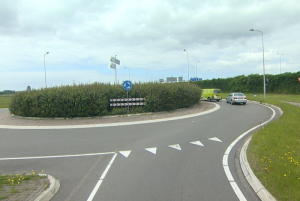

## BUDATA.ROTONDE

* __BGT inhoud:__ ???
* __Herkomst Definitie:__ PNH
* __Positionele nauwkeurigheid:???__ Sub zacht < 25 cm
* __Geometrie:??
* __Definitie:__  Plantvlak temidden van de wegdelen die een rotonde vormen. Plantvak kan schillende soorten vegetatie bevatten.

|-------|------|
|||
|Rotonde|

***

|KOLOM                           	|TYPE          	|DEFINITIE|
|------                          	|----          	|-----    |
|STATUS                          	|VARCHAR2(255) 	|Status van de gegevens, keuzelijst [CT_STATUS]|
|TYPEPLANTVAK1                    	|VARCHAR2(255) 	|Type plantvak, keuzelijst [CT_TYPE_PLANTVAK]|
|TYPEPLANTVAK2                    	|VARCHAR2(255) 	|Type plantvak, keuzelijst [CT_TYPE_PLANTVAK]|
|TYPEPLANTVAK3                    	|VARCHAR2(255) 	|Type plantvak, keuzelijst [CT_TYPE_PLANTVAK]|
|TYPEPLANTVAK4                    	|VARCHAR2(255) 	|Type plantvak, keuzelijst [CT_TYPE_PLANTVAK]|
|HOOGTE                             |VARCHAR2(255) 	|Hoogte vegetatie t.o.v. maaiveld in mm|
|LENGTE                          	|NUMBER(10,0)  	|Lengte plantvak in hele meters|
|GRONDSOORT                      	|VARCHAR2(255) 	|Grondsoort, keuzelijst [CT_GRONDSOORT]|
|ACTUEELBEELD                    	|VARCHAR2(255) 	|Huidige beeld|
|DATUMAANPLANTING                  	|DATE          	|Datum aanplanting|
|DATUMAANPLANTGESCH              	|VARCHAR2(255) 	|Indicatie of datum aanplanting geschat is|
|OMSCHRIJVING                    	|VARCHAR2(255) 	|Extra toelichting|
|HMBEGIN                         	|NUMBER(25,10) 	|Hectometrering begin plantvak|
|HMEIND                          	|NUMBER(25,10) 	|Hectometrering eind plantvak|
|LEVENSVERWACHTING               	|NUMBER(10,0)  	|Levensverwachting|
|EINDBEELD				            |VARCHAR(255)	|Eindbeeld voor plantvak|
|OPMERKINGMBTONDERH              	|VARCHAR2(2000)	|Opmerking mbt onderhoud|
|OPPERVLAKTE                     	|NUMBER(25,10) 	|Oppervlakte m2, 2 decimalen|
|BEHEERDER                       	|VARCHAR2(255) 	|Beheerder van de rotonde, keuzelijst [CT_INSTANTIE]|
|EIGENAAR                        	|VARCHAR2(255) 	|Eigenaar van de rotonde, keuzelijst [CT_INSTANTIE]|
|BRONHOUDER                      	|VARCHAR2(20)  	|BGT, De bronhoudercode van het object|
|IDENTIFICATIE                   	|VARCHAR2(44)  	|BGT, Uniek identificatienummer voor het object dat onveranderlijk is zolang het object bestaat|
|BRONHOUDER                      	|VARCHAR2(20)  	|BGT, De bronhoudercode van het object|
|INONDERZOEK                     	|CHAR(1)       	|BGT, Een aanduiding waarmee wordt aangegeven dat een onderzoek wordt uitgevoerd naar de juistheid van een of meer gegevens van het betreffende object|
|RELHOOGTELIGGING                	|NUMBER(10,0)  	|BGT, Aanduiding voor de relatieve hoogte van het object|
|EINDREGISTRATIE                 	|DATE          	|BGT, Eind van de periode waarop deze instantie van het object geldig is bij de bronhouder. Wanneer deze waarde niet is ingevuld is de instantie nog geldig|
|TIJDSTIPREGISTRATIE             	|DATE          	|BGT, Tijdstip waarop deze instantie van het object is opgenomen door de bronhouder|
|GUID                            	|VARCHAR2(40)  	|Global Unique Identifier|
|ID                              	|NUMBER(10,0)  	|Primary Key|
|IMGEO_LVPUBLICATIEDATUM            |DATE          	|BGT, Tijdstip waarop deze instantie van het object is opgenomen in de Landelijke Voorziening|
|IMGEO_KLASSE                       |NUMBER(10,0)   |BGT, hoofdclassificatie van het object, keuzelijst [CT_IMGEO_KLASSE]|
|IMGEO_FYSIEKVOORKOMEN              |NUMBER(10,0)   |BGT, fysieke voorkomen van het object, keuzelijst [CT_IMGEO_FYSIEKVOORKOMEN]|
|IMGEO_FYSIEKVOORKOMEN_PLUS         |NUMBER(10,0)   |BGT, nadere typering van het fysieke voorkomen van het object, keuzelijst [CT_IMGEO_FYSIEKVOORKOMEN_PLUS]|
|IMGEO_KRUINLIJN		            |NUMBER(2,0)	|BGT, bestaat er een verwijzing naarhet object(lijn) dat de kruinlijn beschrijft: Ja/Nee [CT_JA_NEE] |
|OBJECTID                        	|NUMBER(38,0)   |Interne ID ArcGIS|
|OBJBEGINTIJD                    	|DATE          	|BGT, Datum waarop het object bij de bronhouder is ontstaan|
|OBJEINDTIJD                     	|DATE          	|BGT, Datum waarop het object bij de bronhouder niet meer geldig is|
|OBJECTID                        	|NUMBER(38,0)   |Interne ID ArcGIS|
|GEOMETRIE                       	|SDO_GEOMETRY  	|Vlak|
|TRAJECT                         	|NUMBER(10,0)  	|FK naar Traject|

***
