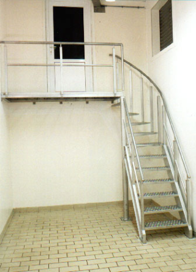

## BUDATA.OVERIG_BOUWWERK

* __BGT inhoud:__ Nee
* __Herkomst Definitie:__ PNH
* __Positionele nauwkeurigheid:__ 5 cm
* __Geometrie:__ Lijn/Vlak, in Overig_bouwwerk_LN en Overig_bouwwerk_VL
* __Definitie:__ Met de aarde verbonden duurzaam bouwwerk, dat niet valt onder de definities van een pand of kunstwerk

|-------|------|
|||
|overig bouwwerk||

***

|KOLOM                               |TYPE              |DEFINITIE|
|------                              |----              |-----    |
|STATUS                              |VARCHAR2(255)     |Status van de gegevens, keuzelijst [CT_STATUS]|
|TYPEOVERIGEBOUWWER                  |VARCHAR2(255)     |Type Overig Bouwwerk, keuzelijst [CT_TYPE_OVERIG_BOUWWERK]|
|ZIJDE                               |VARCHAR2(255)     |Zijde, keuzelijst [CT_ZIJDE]|
|BESTEMMING                          |VARCHAR2(255)     |Bestemming|
|BRUG                                |VARCHAR2(255)     |Brug TODO|
|CONSTRUCTIE                         |VARCHAR2(255)     |Constructie TODO|
|OMSCHRIJVING                        |VARCHAR2(255)     |Omschrijving|
|HECTOMETER                          |VARCHAR2(255)     |Hectometrering|
|HOOGTEBOVENNAP                      |NUMBER(25,10)     |HoogteBoven NAP (cm?) TODO|
|LOOPDEK                             |VARCHAR2(255)     |Loopdek j/n TODO|
|VERLICHT                            |VARCHAR2(255)     |Verlicht j/n|
|BESTEK                              |VARCHAR2(255)     |Bestek, keuzelijst [CT_BESTEK]|
|FUNCTIE                             |VARCHAR2(255)     |Functie, keuzelijst [CT_FUNCTIE]|
|BEHEERDER                           |VARCHAR2(255)     |Beheerder van het object, keuzelijst [CT_BEHEERDER]|
|ONDERHOUDER                         |VARCHAR2(255)     |Onderhouder van het object, keuzelijst [CT_ONDERHOUDER]|
|EIGENAAR                            |VARCHAR2(255)     |Eigenaar van het object, keuzelijst [CT_INSTANTIE]|
|RELHOOGTELIGGING                    |NUMBER(10,0)      |BGT, Aanduiding voor de relatieve hoogte van het object|
|GUID                                |VARCHAR2(40)      |Global Unique Identifier|
|ID                                  |NUMBER(10,0)      |Primary Key|
|IDENTIFICATIE                       |VARCHAR2(44)      |BGT, Uniek identificatienummer voor het object dat onveranderlijk is zolang het object bestaat|
|INONDERZOEK                         |CHAR(1)           |BGT, Een aanduiding waarmee wordt aangegeven dat een onderzoek wordt uitgevoerd naar de juistheid van een of meer gegevens van het betreffende object|
|IMGEO_LVPUBLICATIEDATUM             |DATE              |BGT, Tijdstip waarop deze instantie van het object is opgenomen in de Landelijke Voorziening|
|IMGEO_KLASSE                        |NUMBER(10,0)      |BGT, hoofdclassificatie van het object, keuzelijst [CT_IMGEO_KLASSE]|
|IMGEO_TYPE                          |NUMBER(10,0)      |BGT, typering van het object, keuzelijst [CT_IMGEO_TYPE] |
|IMGEO_TYPE_PLUS                     |NUMBER(10,0)      |BGT, nadere typering van het object, keuzelijst [CT_IMGEO_TYPE_PLUS]|
|IMGEO_KRUINLIJN                     |NUMBER(2,0)       |BGT, bestaat er een verwijzing naarhet object(lijn) dat de kruinlijn beschrijft: Ja/Nee [CT_JA_NEE] |
|OBJECTID                            |NUMBER(38,0)      |Interne ID ArcGIS|
|LAST_UPDATE                         |DATE              |GISIB, Datum waarop het object voor het laatst gewijzigd is in GISIB|
|GEO_OBJECT                          |NUMBER(10,0)      |GISIB, Interne ID van gekoppeld Gisib geo object|
|OBJBEGINTIJD                        |DATE              |BGT, Datum waarop het object bij de bronhouder is ontstaan|
|OBJEINDTIJD                         |DATE              |BGT, Datum waarop het object bij de bronhouder niet meer geldig is|
|TRAJECT                             |NUMBER(10,0)      |FK naar Traject|

***

### BUDATA.OVERIG_BOUWWERK_LN

***

|KOLOM                               |TYPE              |DEFINITIE|
|------                              |----              |-----    |
|GUID                                |VARCHAR2(40)      |Global Unique Identifier|
|GEOMETRIE                           |SDO_GEOMETRY      |Lijn|
|ID                                 |NUMBER(10,0)      |Primary key|
|OBJECTID                            |NUMBER(38,0)   |Interne ID ArcGIS|
|OVERIG_BOUWWERK_ID                    |NUMBER(10,0)    |FK naar Overig_bouwwerk|

***

### BUDATA.OVERIG_BOUWWERK_VL

***

|KOLOM                               |TYPE              |DEFINITIE|
|------                              |----              |-----    |
|GUID                                |VARCHAR2(40)      |Global Unique Identifier|
|GEOMETRIE                           |SDO_GEOMETRY      |Vlak|
|ID                                 |NUMBER(10,0)      |Primary key|
|OBJECTID                            |NUMBER(38,0)   |Interne ID ArcGIS|
|OVERIG_BOUWWERK_ID                    |NUMBER(10,0)    |FK naar Overig_bouwwerk|

***