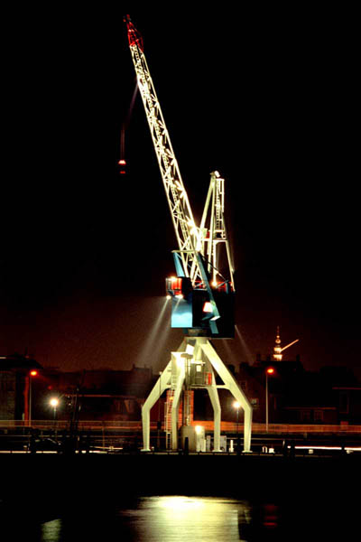

## BUDATA.SPOORRAIL

* __BGT inhoud:__ Nee
* __Herkomst Definitie:__ PNH
* __Positionele nauwkeurigheid:__ nvt
* __Geometrie:__ Lijn
* __Definitie:__ Twee stalen staven op een onderling vaste afstand waarover trein, tram, metro of kraan rijden

|-------|------|
|||
|spoorrail||

***

|KOLOM                           	|TYPE          	|DEFINITIE|
|------                          	|----          	|-----    |
|STATUS                          	|VARCHAR2(255) 	|Status van de gegevens, keuzelijst [CT_STATUS]|
|TYPESPOORRAILS                  	|VARCHAR2(255) 	|Type Spoorrails, keuzelijst [CT_TYPE_SPOORRAILS]|
|OMSCHRIJVING                    	|VARCHAR2(255) 	|Omschrijving|
|HECTOMETER                      	|VARCHAR2(255) 	|Hectometrering|
|ZIJDE                           	|VARCHAR2(255) 	|Zijde, keuzelijst [CT_ZIJDE]|
|BEHEERDER                       	|VARCHAR2(255) 	|Beheerder van de spoorrail, keuzelijst [CT_INSTANTIE]|
|EIGENAAR                        	|VARCHAR2(255) 	|Eigenaar van de spoorrail, keuzelijst [CT_INSTANTIE]|
|RELHOOGTELIGGING                	|NUMBER(10,0)  	|BGT, Aanduiding voor de relatieve hoogte van het object|
|GUID                            	|VARCHAR2(40)  	|Global Unique Identifier|
|GEOMETRIE                       	|SDO_GEOMETRY  	|Lijn|
|ID                              	|NUMBER(10,0)  	|Primary Key|
|OBJBEGINTIJD                    	|DATE          	|BGT, Datum waarop het object bij de bronhouder is ontstaan|
|OBJEINDTIJD                     	|DATE          	|BGT, Datum waarop het object bij de bronhouder niet meer geldig is|
|OBJECTID                        	|NUMBER(38,0)   |Interne ID ArcGIS|
|TRAJECT                         	|NUMBER(10,0)  	|FK naar Traject|
|VAARWEGTRAJECT                  	|NUMBER(10,0)  	|FK naar Vaarwegtraject|

***
