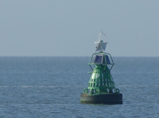

## BUDATA.BETONNING

* __BGT inhoud:__ Nee
* __Herkomst Definitie:__ PNH
* __Positionele nauwkeurigheid:__ 15 cm
* __Geometrie:__ Punt
* __Definitie:__ Betonning is het met behulp van markeringen aangeven van vaarwegen in relatief ondiep water. Dit gebeurt door het plaatsen van tonnen, boeien en bak.

Betonning

***

|KOLOM                               |TYPE              |DEFINITIE|
|------                              |----              |-----    |
|STATUS                              |VARCHAR2(255)     |Status van de gegevens, keuzelijst [CT_STATUS]|
|JAARPLAATSING                       |NUMBER(10,0)      |Is het jaar van aanleg van de betonning|
|TYPEBETONNING                       |VARCHAR2(255)     |Type Betonning, keuzelijst [CT_TYPE_BETONNING]|
|COMMUNICATIEVOORZI                  |VARCHAR2(255)     |Communicatievoorziening|
|OMSCHRIJVING                        |VARCHAR2(255)     |Extra toelichting|
|IDCODE                              |NUMBER(10,0)      |Unieke ID code, komt voor op nautische kaarten|
|LICHTKARAKTER                       |VARCHAR2(255)     |Lichtkarakter, keuzelijst [CT_LICHTKARAKTER]|
|RADARREFLECTIE                      |VARCHAR2(255)     |Radarreflectie aanwezig: Ja/Nee|
|VERLICHTING                         |VARCHAR2(255)     |verlichting aanwezig: Ja/Nee|
|BEVESTINGSWIJZE                     |VARCHAR2(255)     |Bevestigingswijze, keuzelijst [CT_BEVESTIGINGSWIJZE]|
|MATERIAALTYPE                       |VARCHAR2(255)     |Materiaalkeuze, keuzelijst [CT_MATERIAALTYPE]|
|SOORTENERGIE                        |VARCHAR2(255)     |Soort Energie, keuzelijst [CT_SOORT_ENERGIE]|
|VERLICHTING                         |VARCHAR2(255)     |verlichting aanwezig: Ja/Nee|
|ZIJDE                               |VARCHAR2(255)     |Zijde, keuzelijst [CT_ZIJDE]|
|BEHEERDER                           |VARCHAR2(255)     |Beheerder van het object, keuzelijst [CT_BEHEERDER]|
|ONDERHOUDER                         |VARCHAR2(255)     |Onderhouder van het object, keuzelijst [CT_ONDERHOUDER]|
|EIGENAAR                            |VARCHAR2(255)     |Eigenaar van het object, keuzelijst [CT_INSTANTIE]|
|RELHOOGTELIGGING                    |NUMBER(10,0)      |BGT, Aanduiding voor de relatieve hoogte van het object|kruin
|GUID                                |VARCHAR2(40)      |Global Unique Identifier|
|GEOMETRIE                           |SDO_GEOMETRY      |Punt|
|ID                                  |NUMBER(10,0)      |Primary Key|
|IDENTIFICATIE                       |VARCHAR2(44)      |BGT, Uniek identificatienummer voor het object dat onveranderlijk is zolang het object bestaat|
|IMGEO_INONDERZOEK                   |VARCHAR(255)      |BGT, Een aanduiding waarmee wordt aangegeven dat een onderzoek wordt uitgevoerd naar de juistheid van een of meer gegevens van het betreffende object: Ja/Nee [CT_JA_NEE] |
|IMGEO_LVPUBLICATIEDATUM             |DATE              |BGT, Tijdstip waarop deze instantie van het object is opgenomen in de Landelijke Voorziening|
|IMGEO_KLASSE                        |VARCHAR(255)      |BGT, hoofdclassificatie van het object, keuzelijst [CT_IMGEO_KLASSE]|
|IMGEO_TYPE                          |VARCHAR(255)      |BGT, typering van het object, keuzelijst [CT_IMGEO_TYPE] |
|IMGEO_TYPE_PLUS                     |VARCHAR(255)      |BGT, nadere typering van het object, keuzelijst [CT_IMGEO_TYPE_PLUS]|
|OBJECTID                            |NUMBER(38,0)      |Interne ID ArcGIS|
|LAST_UPDATE                         |DATE              |GISIB, Datum waarop het object voor het laatst gewijzigd is in GISIB|
|GEO_OBJECT                          |NUMBER(10,0)      |GISIB, Interne ID van gekoppeld Gisib geo object|
|OBJBEGINTIJD                        |DATE              |BGT, Datum waarop het object bij de bronhouder is ontstaan|
|OBJEINDTIJD                         |DATE              |BGT, Datum waarop het object bij de bronhouder niet meer geldig is|
|TRAJECT                             |NUMBER(10,0)      |FK naar Traject|
|JAAR_PLAATSING_AANLEG_GESCHAT       |NUMBER(2,0)       |Jaar plaatsing of aanleg is geschat: ja of nee (keuzelijst [CT_JA_NEE])| 

***
