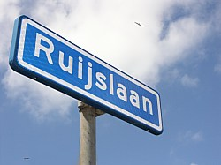
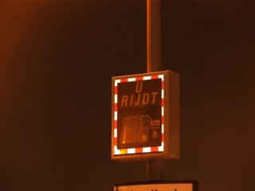
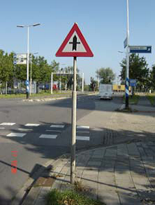
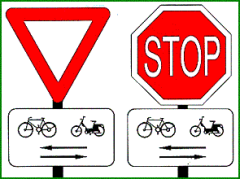

## BUDATA.BORD

* __BGT inhoud:__ Nee
* __Herkomst Definitie:__ PNH
* __Positionele nauwkeurigheid:__ 15 cm
* __Geometrie:__ Punt
* __Definitie:__ Plaat van hout, kunststof, metaal enz, al dan niet met een opschrift.

Naambord - Informatiebord

Verkeersbord - Verkeersbord onderbord

***

|KOLOM                               |TYPE              |DEFINITIE|
|------                              |----              |-----    |
|STATUS                              |VARCHAR2(255)     |Status van de gegevens, keuzelijst [CT_STATUS]|
|ZIJDE                               |VARCHAR2(255)     |Zijde, keuzelijst [CT_ZIJDE]|
|MATERIAALTYPE                       |VARCHAR2(255)     |Materiaalkeuze, keuzelijst [CT_MATERIAALTYPE]|
|REFLECTIEKLASSE                     |VARCHAR2(255)     |Reflectieklasse, keuzelijst [CT_REFLECTIEKLASSE]|
|RVVTYPEBORD                         |VARCHAR2(255)     |RVV Type Bord|
|TEKSTBVBORD                         |VARCHAR2(255)     |Tekst of beeld op het bovenbord dat aan de (weg)gebruiker wordt getoond|
|TEKSTHOOFDBORD                      |VARCHAR2(255)     |Tekst of beeld op het hoofdbord dat aan de (weg)gebruiker wordt getoond|
|TEKSTONDERBORD                      |VARCHAR2(255)     |Tekst of beeld op het onderbord dat aan de (weg)gebruiker wordt getoond|
|WAARDE                              |VARCHAR2(255)     |De waarde die op het bord staat aangegeven. (Welk bord? bvn, hfd, onder? Ook invullen indien de tekst een waarde bevat? TODO|
|BEVESTINGSWIJZE                     |VARCHAR2(255)     |BevestigingsWijze, keuzelijst [CT_BEVESTIGINGSWIJZE]|
|BORDFABRIKANT                       |VARCHAR2(255)     |Bord Fabrikant, keuzelijst [CT_BORD_FABRIKANT]|
|TYPEBORD                            |VARCHAR2(255)     |Type Bord, keuzelijst [CT_TYPE_BORD]|
|TYPELAMP                            |VARCHAR2(255)     |Type Lamp, keuzelijst [CT_TYPE_LAMP]|
|BEHEERDER                           |VARCHAR2(255)     |Beheerder van het object, keuzelijst [CT_BEHEERDER]|
|ONDERHOUDER                         |VARCHAR2(255)     |Onderhouder van het object, keuzelijst [CT_ONDERHOUDER]|
|EIGENAAR                            |VARCHAR2(255)     |Eigenaar van het object, keuzelijst [CT_INSTANTIE]|
|AANGELICHT                          |VARCHAR2(255)     |Aangelicht j/n TODO|
|AFMETINGEN                          |VARCHAR2(255)     |Afmeting klasse opgeven, indien afwijkend in mm|
|BESLUITNUMMER                       |VARCHAR2(255)     |BesluitNummer (nummer van een besluit van een wegbeheerder om een bepaald verkeersteken te plaatsen, te wijzigen of in te trekken of een bepaalde fysieke maatregel te treffen), keuzelijst [CT_BESLUITNUMMER]|
|BESLUITDATUM                        |DATE              |datum dat het besluit|
|BIJZONDERHEID                       |VARCHAR2(255)     |Bijzonderheden|
|DATUMPLAATSING                      |DATE              |Datum plaatsing|
|OMSCHRIJVING                        |VARCHAR2(255)     |Omschrijving|
|FOTO                                |VARCHAR2(255)     |pad naar de foto TODO|
|HECTOMETER                          |VARCHAR2(255)     |Hectometrering|
|HOOGTE                              |NUMBER(10,0)      |Hoogte waarop het bord zit(eenheid? TODO)|
|HOOGTEPALEN                         |NUMBER(25,10)     |Hoogte van de paal waarop het bord zit(eenheid? TODO)|
|LEESZIJDE                           |VARCHAR2(255)     |TODO|
|LEVENSVERWACHTING                   |NUMBER(10,0)      |Levensverwachting van het bord toen het geplaatst werd(jaren) TODO|
|MAXIMUMSNELHEIDGEM                  |VARCHAR2(255)     |MaximunSnelheidGemeld. J/N veld om aan te geven als de toegestane max. snelheid is gemeld op het (hectometerings)bord.|
|OPMERKING                           |VARCHAR2(2000)    |Opmerking (niet bijzonderheid, dat is een ander veld) TODO|
|PLANJAAR                            |NUMBER(10,0)      |Planjaar TODO|
|RESTLEVENSDUUR                      |NUMBER(10,0)      |verwachte restlevensduur vanaf moment inspect (waar wordt inspectiedatum ingevuld?) TODO|
|ROTATIEHOEK                         |NUMBER(10,0)      |Orientatie van het bord|
|CEKEUR                              |VARCHAR2(255)     |CE-Keurmerk aanwezig|
|GARANTIECERTIFICAAT                 |VARCHAR2(255)     |Garantie certificaat aanwezig|
|REFLECTIEWAARDE                     |VARCHAR2(255)     |Gemeten Reflectiewaarde|
|REFLECTIEWAARDE_DATUM               |DATE              |Datum reflectiemeting|
|RELHOOGTELIGGING                    |NUMBER(10,0)      |BGT, Aanduiding voor de relatieve hoogte van het object|
|GUID                                |VARCHAR2(40)      |Global Unique Identifier|
|GEOMETRIE                           |SDO_GEOMETRY      |Punt|
|ID                                  |NUMBER(10,0)      |Primary Key|
|IDENTIFICATIE                       |VARCHAR2(44)      |BGT, Uniek identificatienummer voor het object dat onveranderlijk is zolang het object bestaat|
|IMGEO_INONDERZOEK                   |VARCHAR(255)      |BGT, Een aanduiding waarmee wordt aangegeven dat een onderzoek wordt uitgevoerd naar de juistheid van een of meer gegevens van het betreffende object: Ja/Nee [CT_JA_NEE] |
|IMGEO_LVPUBLICATIEDATUM             |DATE              |BGT, Tijdstip waarop deze instantie van het object is opgenomen in de Landelijke Voorziening|
|IMGEO_KLASSE                        |VARCHAR(255)      |BGT, hoofdclassificatie van het object, keuzelijst [CT_IMGEO_KLASSE]|
|IMGEO_TYPE                          |VARCHAR(255)      |BGT, typering van het object, keuzelijst [CT_IMGEO_TYPE] |
|IMGEO_TYPE_PLUS                     |VARCHAR(255)      |BGT, nadere typering van het object, keuzelijst [CT_IMGEO_TYPE_PLUS]|
|OBJBEGINTIJD                        |DATE              |BGT, Datum waarop het object bij de bronhouder is ontstaan|
|OBJEINDTIJD                         |DATE              |BGT, Datum waarop het object bij de bronhouder niet meer geldig is|
|OBJECTID                            |NUMBER(38,0)      |Interne ID ArcGIS|
|LAST_UPDATE                         |DATE              |GISIB, Datum waarop het object voor het laatst gewijzigd is in GISIB|
|GEO_OBJECT                          |NUMBER(10,0)      |GISIB, Interne ID van gekoppeld Gisib geo object|
|TRAJECT                             |NUMBER(10,0)      |FK naar Traject|
|UITLEGGERPORTAAL                    |NUMBER(10,0)      |FK naar Uitleggerportaal|
|WEGWIJZER                           |NUMBER(10,0)      |FK naar Wegwijzer|
|KRUISPUNT                           |NUMBER(10,0)      |FK naar Kruispunt|
|MAST                                |NUMBER(10,0)      |FK naar Mast|

***
