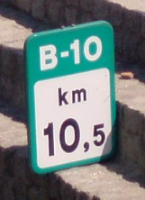

## BUDATA.INDEXERINGSPAAL

* __BGT inhoud:__ Nee
* __Herkomst Definitie:__ PNH
* __Positionele nauwkeurigheid:__ nvt
* __Geometrie:__ Punt
* __Definitie:__ Paaltje of bordje geplaatst langs de (vaar)weg, waarop een hectometerwaarde(weg) of kilometrering(vaarweg) is vermeld eventueel gevolgd door een letter

|-------|------|
|||
|indexeringspaal||

***

|KOLOM                           	|TYPE          	|DEFINITIE|
|------                          	|----          	|-----    |
|ID                              	|NUMBER(10,0)  	|Primary Key|
|GEOMETRIE                       	|SDO_GEOMETRY  	|punt|
|DATUMPLAATSING                  	|DATE          	|Datum plaatsing|
|OMSCHRIJVING                    	|VARCHAR2(255) 	|Omschrijving|
|GUID                            	|VARCHAR2(40)  	|Global Unique Identifier|
|HECTOMETER                      	|VARCHAR2(255)	|Hectometrering|
|LEVENSVERWACHTING               	|NUMBER(10,0)  	|Levensverwachting van het bord toen het geplaatst werd(jaren) TODO|
|PLANJAAR                        	|NUMBER(10,0)  	|Planjaar TODO|
|RESTLEVENSDUUR                  	|NUMBER(10,0)  	|verwachte restlevensduur vanaf moment inspect (waar wordt inspectiedatum ingevuld?) TODO|
|SNELHEID                        	|NUMBER(10,0)  	|Snelheid aangegeven op het bord|
|TEKST                           	|VARCHAR2(255) 	|Tekst aangegeven op het bord|
|TYPEUITVOERING                  	|VARCHAR2(255) 	|Type Indexeringspaal|
|STATUS                          	|VARCHAR2(255) 	|Status van de gegevens, keuzelijst [CT_STATUS]|
|TRAJECT                         	|NUMBER(10,0)  	|FK naar Traject|
|VAARWEGTRAJECT                  	|NUMBER(10,0)  	|FK naar Vaarwegtraject|
|ZIJDE                           	|VARCHAR2(255) 	|Zijde, keuzelijst [CT_ZIJDE]|
|BEHEERDER                       	|VARCHAR2(255) 	|Beheerder van de indexeringspaal, keuzelijst [CT_INSTANTIE]|
|EIGENAAR                        	|VARCHAR2(255) 	|Eigenaar van de indexeringspaal, keuzelijst [CT_INSTANTIE]|
|OBJBEGINTIJD                    	|DATE          	|BGT, Datum waarop het object bij de bronhouder is ontstaan|
|OBJEINDTIJD                     	|DATE          	|BGT, Datum waarop het object bij de bronhouder niet meer geldig is|
|OBJECTID                        	|NUMBER(38,0)   |Interne ID ArcGIS|
|RELHOOGTELIGGING                	|NUMBER(10,0)  	|BGT, Aanduiding voor de relatieve hoogte van het object|

***
