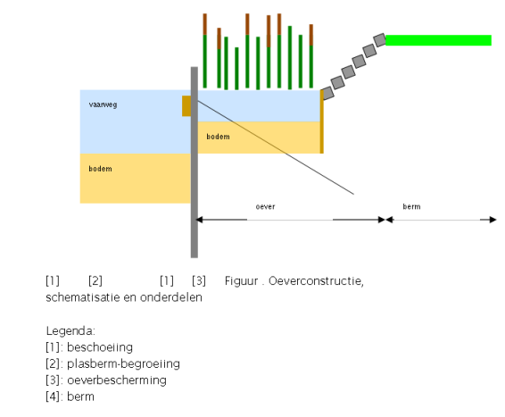

# Vaarwegen

De Provincie Noord Holland beheert ongeveer 500km vaarwegen. Een vaarweg is een samenhangende eenheid binnen de natte verkeersinfrastructuur voor het vervoeren van mensen en goederen. Het kan ook de aanvoer, afvoer, kering en berging van water mogelijk maken.

Kenmerkend voor het vaarweg beheer is dat het gaat om een verzameling van objecten die samen een (sub)functioneel geheel vormen en die aan elkaar zijn gebonden door een locatie. De vaarwegbeheerder is verantwoordelijk voor het integrale beheer van alle onderliggende objecten door de functionele eis van de vaarweg te waarborgen . Het beheer van het vervoersysteem is dan leidend en bepalend voor het beheer van onderliggende objecten. De beheersystematiek die de Provincie gebruikt om dit te realiseren is de zogenoemde traject aanpak, waardoor vaarwegen logischerwijs ingedeeld worden en daaronder wordt het beheersregime bepaald en toegepast via de meerjarenplanning. In deze planning wordt de planningen van individuele objecttypen met elkaar afgestemd om tot een integraal geheel te komen.

### NEN 2767-4

Voor het vaarwegen datamodel wordt ook een NEN 2767-4 decompositie ingevoerd.
Hierbij wordt het Oevervak gelijkgesteld aan het Beheerobject. Binnen een oevervak vallen dan Vaarweg elementen en vaarweg bouwdelen. De Oevervakken worden als een functioneel gebied door middel van een vlak gevisualiseerd. De Elementen binnen een oevervak zijn de daadwerkelijke oeverconstructies. Deze worden op coordinaten ingemeten conform de BGT richtlijnen (of beter als daar bij PNH behoefte aan is). De Bouwdelen worden alleen alfanumeriek vastgelegd.

Schematische weergave van een oeverconstructie

