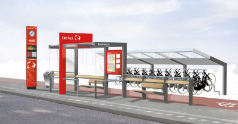

## BUDATA.HALTE

* __BGT inhoud:__ Nee
* __Herkomst Definitie:__ PNH/NDOV
* __Positionele nauwkeurigheid:__ nvt
* __Geometrie:__ Vlak
* __Definitie:__ Het geheel van objecten behorende bij een stopplaats van een autobus. (Integraal Gegevens Model Ideaal Areaal 1.2). STOPPLACE in NDOV terminologie

|-------|------|
|||
|Halte||

***

|KOLOM                               |TYPE              |DEFINITIE|
|------                              |----              |-----    |
|STATUS                              |VARCHAR2(255)     |Status van de gegevens, keuzelijst [CT_STATUS]|
|NAAM                                |VARCHAR2(255)     |Naam vd Halte|
|WEGNAAM                             |VARCHAR2(255)     |Naam vd Weg|
|WEGNUMMER                           |VARCHAR2(255)     |Nummer vd Weg|
|BEHEERDER                           |VARCHAR2(255)     |Beheerder van het object, keuzelijst [CT_BEHEERDER]|
|ONDERHOUDER                         |VARCHAR2(255)     |Onderhouder van het object, keuzelijst [CT_ONDERHOUDER]|
|EIGENAAR                            |VARCHAR2(255)     |Eigenaar van het object, keuzelijst [CT_INSTANTIE]|
|GEMEENTE                            |VARCHAR2(255)     |Gemeentenaam, keuzelijst [CT_GEMEENTE]|
|HALTENUMMER                         |VARCHAR2(255)     |Identificatienummer van de Halte. Let op: Het landelijk unieke nummer van NDOV staat bij Perron!|
|PROJECT                             |VARCHAR2(20)      |Ja/Nee [CT_JA_NEE]|
|SUBSIDIEPROJECT                     |VARCHAR2(255)     |Naam van het subsidieproject voor aanleg|
|HALTEKOM                            |VARCHAR2(20)      |Ja/Nee [CT_JA_NEE]|
|ONDERHOUDSOVEREENKOMST              |VARCHAR2(255)     |Verwijzing naar de Onderhoud overeenkomst (documentnr, locatie e.d.)|
|FOTO                                |VARCHAR2(255)     |Verwijzing naar naam/locatie van een foto vd Halte|
|ELEKTROTECHN_TEKENING               |VARCHAR2(255)     |Verwijzing naar naam/locatie van een elektrotechnische tekening vd Halte|
|WOONPLAATS                          |VARCHAR2(255)     |ToDo|
|WINDROOSRICHTING                    |NUMBER(3,0)       |ToDo|
|STATUS_HALTE                        |VARCHAR2(255)     |ToDo|
|TYPE_HALTE                          |VARCHAR2(255)     |ToDo|
|GUID                                |VARCHAR2(40)      |Global Unique Identifier|
|GEOMETRIE                           |SDO_GEOMETRY      |Vlak|
|ID                                  |NUMBER(10,0)      |Primary Key|
|OBJECTID                            |NUMBER(38,0)      |Interne ID ArcGIS|
|LAST_UPDATE                         |DATE              |GISIB, Datum waarop het object voor het laatst gewijzigd is in GISIB|
|OBJBEGINTIJD                        |DATE              |BGT, Datum waarop het object bij de bronhouder is ontstaan|
|OBJEINDTIJD                         |DATE              |BGT, Datum waarop het object bij de bronhouder niet meer geldig is|
|CONCESSIEVERL_GEBRUIK               |NUMBER(10,0)      |FK naar Concessieverlener voor het gebruik [BUDATA.CONCESSIEVERLENER]|
|CONCESSIEVERL_PLAATSING             |NUMBER(10,0)      |FK naar Concessieverlener voor de plaatsing [BUDATA.CONCESSIEVERLENER]|
|TRAJECT                             |NUMBER(10,0)      |FK naar Traject|

***
