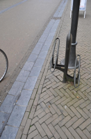

## BUDATA.FIETSPARKEERVOORZIENING

* __BGT inhoud:__ Nee
* __Herkomst Definitie:__ PNH 
* __Positionele nauwkeurigheid:__ conform specificatie PNH
* __Geometrie:__ Lijn
* __Definitie:__ Onderdeel van [Straatmeubilair][BUDATA.STRAATMEUBILAIR], maar vanwege de extra gegevens als apart object opgenomen. 

|-------|------|
|||
|Fietsparkeervoorziening||

***

|KOLOM                           	|TYPE          	|DEFINITIE|
|------                          	|----          	|-----    |
|STATUS                          	|VARCHAR2(255) 	|Status van de gegevens, keuzelijst [CT_STATUS]|
|TYPEFIETSPARKEERVOORZ           	|VARCHAR2(255) 	|Type|
|ID                              	|NUMBER(10,0)  	|Primary Key|
|GEOMETRIE                       	|SDO_GEOMETRY  	|Lijn|
|DATUMPLAATSING                  	|DATE          	|Datum plaatsing|
|OMSCHRIJVING                    	|VARCHAR2(255) 	|extra ruimte voor toelichting|
|GUID                            	|VARCHAR2(40)  	|Global Unique Identifier|
|HECTOMETER                      	|VARCHAR2(255) 	|Hectometrering waar de voorziening is geplaatst|
|BEHEERDER                       	|VARCHAR2(255) 	|Beheerder van de voorziening, keuzelijst [CT_INSTANTIE]|
|EIGENAAR                        	|VARCHAR2(255) 	|Eigenaar van de voorziening, keuzelijst [CT_INSTANTIE]|
|OBJBEGINTIJD                    	|DATE          	|Datum waarop het object bij de bronhouder is ontstaan|
|OBJEINDTIJD                     	|DATE          	|Datum waarop het object bij de bronhouder niet meer geldig is|
|OBJECTID                        	|NUMBER(38,0)  	|Interne ID ArcGIS|
|GARANTIECERTIFICAAT             	|VARCHAR2(255) 	|Verwijzing naar certificaat|
|FOTO                            	|VARCHAR2(255) 	|Verwijzing naar naam/locatie foto|
|FABRIKANT                       	|VARCHAR2(255) 	|Naam vd Fabrikant|
|HALTE                           	|NUMBER(10,0)  	|Verwijzing naar de Halte [BUDATA.HALTE]|
|CAPACITEIT                      	|NUMBER(10,0)  	|Aantal fietsplaatsen|

***