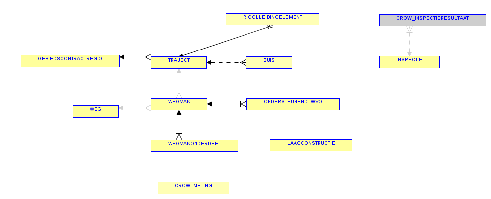

# Verharding

De provincie Noord-Holland beheert in de rol van eigenaar en beheerder van de provinciale eigendommen onderhouds- en realisatieprojecten van verhardingen, ten einde de functionaliteit van het provinciale wegennet te handhaven en/of uit te breiden.

In de areaaldefinitie zijn verhardingen gedefinieerd als gebaande gedeelten voor het wegverkeer die onder de verantwoordelijkheid van de provincie Noord-Holland vallen. De verhardingstyperingen (rijbaan, voetpad, fietspad etc.) sluiten aan op de CROW methodiek. (weg functies)

### BGT

De BGT objecten WEGDEEL en ONDERSTEUNEND WEGDEEL worden geaggregeerd uit WEGVAKONDERDEEL en PERRON

