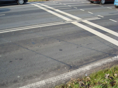
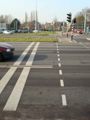

## BUDATA.LUS

* __BGT inhoud:__ Nee
* __Herkomst Definitie:__ PNH
* __Positionele nauwkeurigheid:__ 15 cm
* __Geometrie:__ Lijn
* __Definitie:__ Of een fysiek detectiesysteem bestaande uit wikkelingen (lussen) in het wegdek bijvoorbeeld voor het beïnvloeden van de regeling van verkeerslichten of een virtueel detectieveld van een videodetector of radardetector, gebruikt voor het beïnvloeden van regelingen van verkeerslichten

Fysieke lus t.b.v. melding VRI - Fysieke lus t.b.v. snelheid

***

|KOLOM                               |TYPE              |DEFINITIE|
|------                              |----              |-----    |
|STATUS                              |VARCHAR2(255)     |Status van de gegevens, keuzelijst [CT_STATUS]|
|OMSCHRIJVING                        |VARCHAR2(255)     |Extra toelichting|
|AANTALWINDINGEN                     |NUMBER(10,0)      |Aantal windingen|
|DATUMGARANTIE                       |DATE              |Datum garantie|
|DATUMPLAATSING                      |DATE              |Datum plaatsing|
|JAAR_PLAATSING_AANLEG_GESCHAT       |VARCHAR(255)      |Jaar plaatsing of aanleg is geschat: ja of nee (keuzelijst [CT_JA_NEE])|
|DETECTIENUMMER                      |VARCHAR2(255)     |Detectie nummer|
|TYPELUS                             |VARCHAR2(255)     |Type lus, keuzelijst [CT_TYPE_LUS]|
|BEHEERDER                           |VARCHAR2(255)     |Beheerder van het object, keuzelijst [CT_BEHEERDER]|
|ONDERHOUDER                         |VARCHAR2(255)     |Onderhouder van het object, keuzelijst [CT_ONDERHOUDER]|
|EIGENAAR                            |VARCHAR2(255)     |Eigenaar van het object, keuzelijst [CT_INSTANTIE]|
|GUID                                |VARCHAR2(40)      |Global Unique Identifier|
|GEOMETRIE                           |SDO_GEOMETRY      |Lijn|
|ID                                  |NUMBER(10,0)      |Primary Key|
|OBJECTID                            |NUMBER(38,0)      |Interne ID ArcGIS|
|LAST_UPDATE                         |DATE              |GISIB, Datum waarop het object voor het laatst gewijzigd is in GISIB|
|OBJBEGINTIJD                        |DATE              |BGT, Datum waarop het object bij de bronhouder is ontstaan|
|OBJEINDTIJD                         |DATE              |BGT, Datum waarop het object bij de bronhouder niet meer geldig is|
|TRAJECT                             |NUMBER (10,0)     |FK naar Traject|
|DETECTIE                            |NUMBER(10,0)      |FK naar Detectie behorende bij de lus|

***

