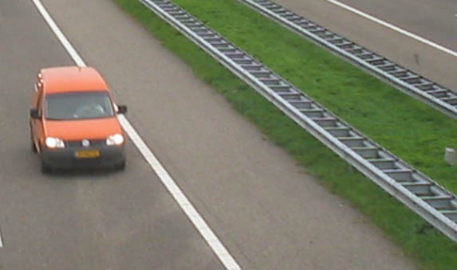

## BUDATA.GELEIDERAIL

* __BGT inhoud:__ Nee
* __Herkomst Definitie:__ PNH
* __Positionele nauwkeurigheid:__ 15 cm
* __Geometrie:__ lijn
* __Definitie:__ Een geleiderail of vangrail is een barrière die naast wegen wordt geplaatst om te voorkomen dat voertuigen de weg in zijdelingse richting verlaten, kantelen of de middenberm doorkruisen

Geleiderail

***

|KOLOM                               |TYPE              |DEFINITIE|
|------                              |----              |-----    |
|STATUS                              |VARCHAR2(255)     |Status van de gegevens, keuzelijst [CT_STATUS]|
|TYPEGELEIDERAIL                     |VARCHAR2(255)     |Type Geleiderail, keuzelijst [CT_TYPE_GELEIDERAIL]|
|ZIJDE                               |VARCHAR2(255)     |Zijde, keuzelijst [CT_ZIJDE]|
|ANTIVERBLINDINGSSC                  |VARCHAR2(255)     |AntiVerblindingsScherm j/n|
|BEVESTIGING                         |VARCHAR2(255)     |Bevestiging|
|DATUMPLAATSING                      |DATE              |Datum Plaatsing|
|OMSCHRIJVING                        |VARCHAR2(255)     |Klasse geleiderail (W1-W8)|
|FUNDERING                           |VARCHAR2(255)     |Fundering|
|HMBEGIN                             |NUMBER(25,10)     |Hectometrering in kilometers|
|HMEIND                              |NUMBER(25,10)     |Hectometrering in kilometers|
|HOOGTESCHILD                        |VARCHAR2(255)     |Hoogte van het Schild|
|LENGTE                              |NUMBER(10,0)      |Lengte (m) van de geleiderail, bij tweezijdig uitgebouwde geleiderails dient de lengte aan beide zijden opgenomen te worden.|
|LEVENSVERWACHTING                   |NUMBER(10,0)      |Levensverwachting van het bord toen het geplaatst werd(jaren) TODO|
|MOTORVRIENDELIJK                    |VARCHAR2(255)     |MotorVriendelijk j/n|
|PLANJAAR                            |NUMBER(10,0)      |Planjaar TODO|
|REFLECTOR                           |VARCHAR2(255)     |Reflector j/n|
|RESTLEVENSDUUR                      |NUMBER(10,0)      |verwachte restlevensduur vanaf moment inspect (waar wordt inspectiedatum ingevuld?) TODO|
|MATERIAALTYPE                       |VARCHAR2(255)     |Materiaalkeuze, keuzelijst [CT_MATERIAALTYPE]|
|BEHEERDER                           |VARCHAR2(255)     |Beheerder van het object, keuzelijst [CT_BEHEERDER]|
|ONDERHOUDER                         |VARCHAR2(255)     |Onderhouder van het object, keuzelijst [CT_ONDERHOUDER]|
|EIGENAAR                            |VARCHAR2(255)     |Eigenaar van het object, keuzelijst [CT_INSTANTIE]|
|CEKEUR                              |VARCHAR2(255)     |CE-Keurmerk aanwezig|
|GARANTIECERTIFICAAT                 |VARCHAR2(255)     |Garantie certificaat aanwezig|
|FOTO                                |VARCHAR2(255)     |Verwijzing naar een Foto|
|FABRIKANT                           |VARCHAR2(255)     |Fabrikant|
|RELHOOGTELIGGING                    |NUMBER(10,0)      |BGT, Aanduiding voor de relatieve hoogte van het object|
|GUID                                |VARCHAR2(40)      |Global Unique Identifier|
|GEOMETRIE                           |SDO_GEOMETRY      |Lijn|
|ID                                  |NUMBER(10,0)      |Primary Key|
|IDENTIFICATIE                       |VARCHAR2(44)      |BGT, Uniek identificatienummer voor het object dat onveranderlijk is zolang het object bestaat|
|IMGEO_BRONHOUDER                    |VARCHAR2(20)      |BGT, De bronhoudercode van het object|
|IMGEO_INONDERZOEK                   |VARCHAR(255)      |BGT, Een aanduiding waarmee wordt aangegeven dat een onderzoek wordt uitgevoerd naar de juistheid van een of meer gegevens van het betreffende object: Ja/Nee [CT_JA_NEE] |
|IMGEO_LVPUBLICATIEDATUM             |DATE              |BGT, Tijdstip waarop deze instantie van het object is opgenomen in de Landelijke Voorziening|
|IMGEO_KLASSE                        |VARCHAR(255)      |BGT, hoofdclassificatie van het object, keuzelijst [CT_IMGEO_KLASSE]|
|IMGEO_TYPE                          |VARCHAR(255)      |BGT, typering van het object, keuzelijst [CT_IMGEO_TYPE] |
|IMGEO_TYPE_PLUS                     |VARCHAR(255)      |BGT, nadere typering van het object, keuzelijst [CT_IMGEO_TYPE_PLUS]|
|OBJECTID                            |NUMBER(38,0)      |Interne ID ArcGIS|
|LAST_UPDATE                         |DATE              |GISIB, Datum waarop het object voor het laatst gewijzigd is in GISIB|
|GEO_OBJECT                          |NUMBER(10,0)      |GISIB, Interne ID van gekoppeld Gisib geo object|
|OBJBEGINTIJD                        |DATE              |BGT, Datum waarop het object bij de bronhouder is ontstaan|
|OBJEINDTIJD                         |DATE              |BGT, Datum waarop het object bij de bronhouder niet meer geldig is|
|TRAJECT                             |NUMBER(10,0)      |FK naar Traject|

***
